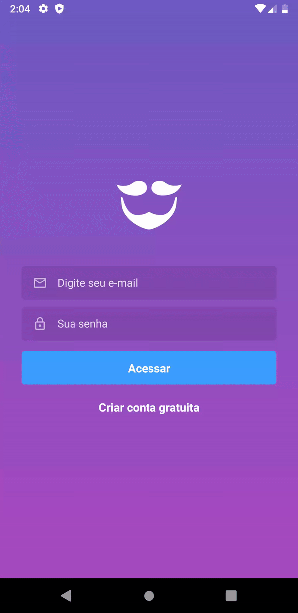

<h1 align="center">

</h1>

### :page_with_curl: About
This project is based on an application for a hair salon. Containing scheduling, appointments, session and authentication.

#### To start, **Docker** is required

### :rocket: How to install and start 
- `git clone https://github.com/jonabf1/goBarber`
- **Go to repository folder**
- `docker-compose up` (in Backend)
- `yarn start` (in Frontend)

### :page_facing_up: Routes in Backend

- **post('/users')** - Create a login
- **post('/sessions')** - Log in to an account

#### From here, authentication is required

- **put('/users')** - Update an account
- **get('/providers')** - List providers
- **get('/providers/:providerId/available')** - Check provider availability
- **post('/appointments')** - Create an appointment
- **get('/appointments')** - List all logged-in user's appointments
- **delete('/appointments/:id')** - Delete an appointment
- **get('/schedule')** - Schedule services
- **post('/files')** - Profile pictures
- **get('/notifications')** - List all logged in user notifications
- **put('/notifications/:id')** - Confirm notification was seen    

### :heavy_check_mark: Result in Frontend

  

### :heavy_check_mark: Result in Mobile

  

---

Made with ♥ by <a href="https://www.linkedin.com/in/jonathan-barros-franco">Jonathan</a>

